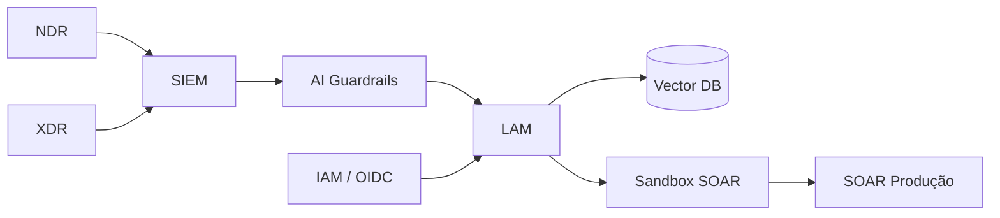

# ai-security-roadmap-lam

**MITx xPro — Cybersecurity for Technical Leaders**

Roadmap executivo e técnico de segurança para **LAM (Large Action Model)** autônomo em stack **NDR → XDR → SIEM → LAM → SOAR**, com governança LGPD, Zero Trust e quantificação de risco (FAIR).

---

## Objetivos de estudo

O xPro Cybersecurity for Technical Leaders prepara executivos técnicos para decisões em ambientes onde **IA autônoma** (agentes, LLMs, RAG) coexiste com infraestrutura crítica. Este repositório materializa o Capstone Final em documentação estruturada: mapear stakeholders (CISO vs DPO), quantificar risco (FAIR), definir métricas operacionais (MTTD, FPR, PIS), e propor controles (AI Guardrails, IAM para agentes, logs WORM). O objetivo não é "passar no curso" — é construir um **framework reutilizável** para qualquer organização que deploy LAM/LLM em pipeline de detecção e resposta.

---

## Arquitetura de referência

O diagrama mostra o **fluxo de decisão**: alertas entram pelo SIEM, passam por validação (Guardrails) antes de chegar ao LAM, que consulta Vector DB e só então propõe ações SOAR — primeiro em sandbox, depois em produção. IAM controla identidade do agente separadamente de usuários humanos. Cada seta é um ponto de falha potencial documentado no Capstone.

---

## Métricas técnicas do LAM

| Métrica | Definição | Alvo | Por que importa |
|---------|-----------|------|-----------------|
| **MTTD** | Mean Time to Detect | < 5 min | Velocidade de resposta |
| **FPR** | False Positive Rate | < 2% | Evita fadiga e ações erradas |
| **PIS** | Prompt/Embedding Integrity | > 99.5% | Detecta injection/poisoning |
| **CRI** | Cost of Incidents | Tolerância CISO | Linguagem financeira para board |
| **Compliance Score** | Trilha WORM completa | > 98% | LGPD Art. 20 — decisões auditáveis |

---

## Módulos

| Pasta | Conteúdo |
|-------|----------|
| [`roadmap/`](roadmap/) | Capstone 6 partes — problema, stakeholders, arquitetura, métricas, resposta |
| [`weeks/`](weeks/) | Síntese técnica das 8 semanas (adversarial AI, LLM security, FAIR) |
| [`ai-incidents/`](ai-incidents/) | MITRE ATLAS + OWASP LLM Top 10 |
| [`risk-models/`](risk-models/) | FAIR, perda esperada, tolerância |

## Caso de uso central

> Prompt malicioso no SIEM → contamina RAG → inferência errada → SOAR dispara ação incorreta → interrupção em infraestrutura crítica (BCB, INSS, telco).

A cadeia não é hipotética — é o cenário que o Capstone usa para justificar **governança de IA autônoma**, não apenas segurança de modelo.

---

## Aprendizados e aplicação no mercado

O mercado brasileiro de cibersegurança está adotando IA (NDR cognitivo, copilots SOC, agentes SOAR) mais rápido que a governança acompanha. Este repositório oferece: **(1)** linguagem para conversar com CISO e DPO simultaneamente; **(2)** métricas que traduzem risco técnico em impacto de negócio (CRI, downtime); **(3)** controles concretos (sandbox SOAR, IAM de agente, WORM) em vez de "política de IA" vaga. Para CTO em X-Core, fintech ou governo, é o blueprint de **AI-First security** com compliance LGPD — o diferencial competitivo entre "temos um LLM no SOC" e "temos um LAM governado".

---

## Portfólio

- [Portfolio AI Engineer / CTO](https://portfolio-ai-cto-guaranta.netlify.app)

## Autor

**Guarantã Almeida** — [github.com/guaranta](https://github.com/guaranta)
