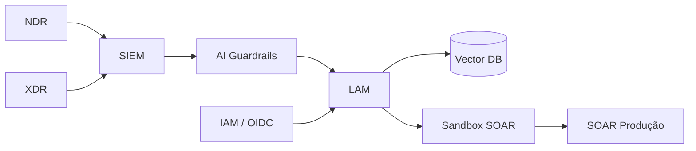

# ai-security-roadmap-lam

**MITx xPro — Cybersecurity for Technical Leaders**

Roadmap executivo e técnico de segurança para **LAM (Large Action Model)** autônomo em stack **NDR → XDR → SIEM → LAM → SOAR**, com governança LGPD, Zero Trust e quantificação de risco (FAIR).

---

## Arquitetura de referência



---

## Métricas técnicas do LAM

| Métrica | Definição | Alvo |
|---------|-----------|------|
| **MTTD** | Mean Time to Detect | < 5 min |
| **FPR** | False Positive Rate (playbooks auto) | < 2% |
| **PIS** | Prompt/Embedding Integrity Score | > 99.5% |
| **CRI** | Cost of Incidents (IA) | Tolerância CISO |
| **Compliance Score** | Decisões com trilha WORM | > 98% |

## Modelo de risco

```
Risco = P(incidente) × Impacto × Exposição
FAIR: LEF = TEF × Vuln;  Risk = LEF × LM
```

Exemplo ilustrativo (FAIR): 50 tentativas/dia × 5% bypass × R$ 500k/incidente grave.

---

## Módulos

| Pasta | Conteúdo |
|-------|----------|
| [`roadmap/`](roadmap/) | Capstone 6 partes — problema, stakeholders, arquitetura, métricas, resposta |
| [`weeks/`](weeks/) | Síntese técnica das 8 semanas |
| [`ai-incidents/`](ai-incidents/) | MITRE ATLAS + OWASP LLM Top 10 |
| [`risk-models/`](risk-models/) | FAIR, perda esperada, tolerância |

## Caso de uso central

> Prompt malicioso no SIEM → contamina RAG → inferência errada → SOAR dispara ação incorreta → interrupção de serviço em infraestrutura crítica (BCB, INSS, telco).

**Resposta:** AI Guardrails Layer + sandbox SOAR + IAM distinto para agentes + logs WORM.

## Portfólio

- [Portfolio AI Engineer / CTO](https://portfolio-ai-cto-guaranta.netlify.app)

## Autor

**Guarantã Almeida** — [github.com/guaranta](https://github.com/guaranta)
