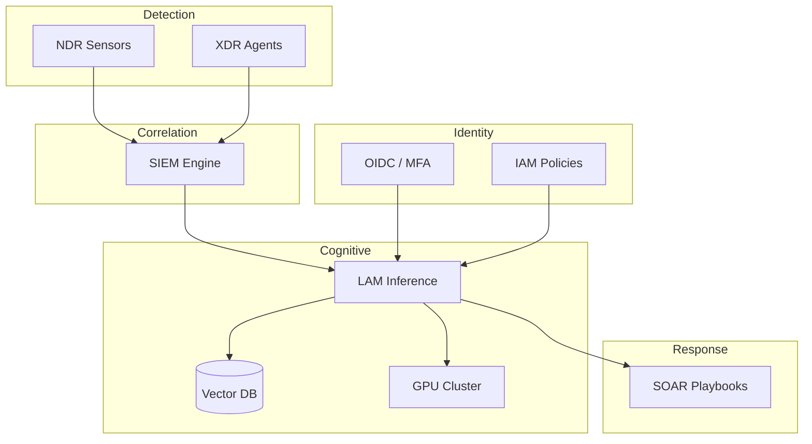

# Part III — Data & Infrastructure Assessment

## Mapa arquitetural

## Avaliação por camada

### AI Security (LAM + Vector DB) — **crítico**

| Risco | Severidade | Mitigação |
|-------|------------|-----------|
| Prompt injection via alertas SIEM | Alta | Validação de entrada, sandbox de prompts |
| Embedding poisoning | Alta | Microsegmentação do Vector DB, versionamento |
| Ações SOAR não autorizadas | Crítica | Policy-bounded agents, allowlist de playbooks |
| Model inversion | Média | Rate limiting, output filtering |

### IAM — **crítico**

| Gap | Impacto |
|-----|---------|
| Agente LAM sem identidade distinta | Ações não rastreáveis |
| Escopos API amplos | Movimento lateral |
| Sem MFA para service accounts | Comprometimento silencioso |

### Zero Trust — **parcial**

Princípios não aplicados consistentemente ao Vector DB e pipelines de inferência. Proposta: **zona cognitiva** isolada com inspeção de tráfego entre LAM e SOAR.
