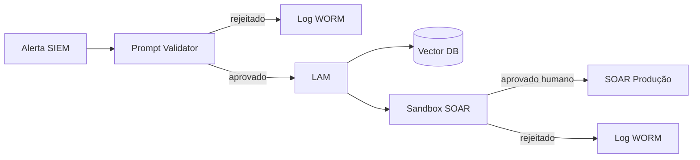

# Part V — Executive Technical Response

## 1. AI Guardrails Layer

Camada de validação entre SIEM e LAM:

- **Prompt validation:** sanitização de alertas antes da inferência
- **Sandbox de ações:** playbooks SOAR executados em ambiente isolado antes de produção
- **Logs WORM:** trilha imutável de prompts, embeddings consultados e ações disparadas
- **Detecção de injection:** heurísticas + classificador leve para payloads suspeitos

## 2. Microsegmentação do Vector DB

- Zona cognitiva isolada (Zero Trust)
- Acesso read-only do LAM com allowlist de coleções
- Versionamento de embeddings com rollback
- Monitoramento de drift em distribuição de embeddings

## 3. IAM para agentes de IA

- Identidade distinta para o LAM (service account com escopo mínimo)
- MFA para service accounts críticos
- Políticas baseadas em atributos (ABAC) para ações SOAR
- Auditoria separada: ações humanas vs ações de agente

## 4. Governança multidisciplinar

| Ritmo | Atividade |
|-------|-----------|
| Mensal | Comitê de governança de IA (CISO, DPO, engenharia) |
| Trimestral | Red teaming adversarial (prompt injection, embedding poisoning) |
| Contínuo | Monitoramento de métricas MTTD, FPR, PIS, Compliance Score |

## Diagrama de controles

