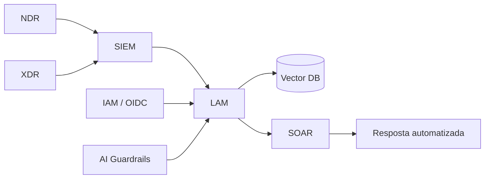

# Systems-Based Cybersecurity Roadmap — X-Core / LAM

Roadmap de segurança para uma plataforma de ciberdefesa com **LAM (Large Action Model)** autônomo em stack **NDR → XDR → SIEM → LAM → SOAR**.

## Arquitetura (visão geral)

## Documentos

| # | Arquivo | Tema |
|---|---------|------|
| 1 | [01-problem-statement.md](01-problem-statement.md) | Contexto nacional, vulnerabilidades sistêmicas |
| 2 | [02-stakeholders.md](02-stakeholders.md) | CISO, DPO, SOC, compliance — tensões LGPD |
| 3 | [03-architecture-assessment.md](03-architecture-assessment.md) | NDR/XDR/SIEM/SOAR, Vector DB, IAM |
| 4 | [04-metrics-kpis.md](04-metrics-kpis.md) | MTTD, FPR, PIS, CRI, Compliance Score |
| 5 | [05-technical-response.md](05-technical-response.md) | Guardrails, microsegmentação, IAM para agentes |
| 6 | [06-executive-reflection.md](06-executive-reflection.md) | Lições e próximos passos |

## Problema central

> Falta de governança para IA autônoma no pipeline de detecção e resposta — onde um prompt malicioso pode contaminar RAG, desviar inferência e acionar ações SOAR com impacto operacional real.
